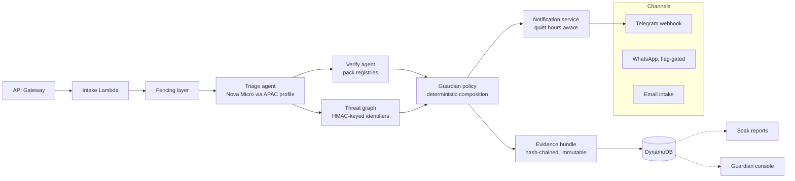

# Gatehouse

> Nothing harmful gets past the gate.

An autonomous fraud-defense agent for households. Family members simply
forward any suspicious message, payment request, or unknown contact: a team
of agents investigates it like a professional fraud analyst (claim
verification against issuer and trusted-service registries, privacy
preserving cross-household threat graph, bounded engagement of suspected
scammers) and escalates only genuine decisions to the family guardian with a
court-grade evidence bundle. Built on the Strands Agents SDK and deployed on
AWS (Lambda, Bedrock, DynamoDB, EventBridge).

**Status: live in staging with real households on soak; console in
development on the locked design system.**

## The 30-second version

On day one of real family use, two near-identical "Kotak fraud alert"
messages arrived. One carried a link on the bank's genuine surface: the
system escalated it conservatively with evidence instead of guessing. The
other pointed at `kotak.bank.in`, a spoof domain outside the issuer
registry: hard fail, verdict SCAM, guardian notified with the full bundle
while the member was told to hold off. Two texts that look the same to a
human, and the gate adjudicated the difference.

## Architecture



Models propose scores; code decides verdicts. Every dependency failure
produces a named degraded mode, never a silent pass. Every log line passes a
scrubber; canary strings in CI prove personal data never reaches
observability sinks.

## Measured results

Staging evaluation, dev split, 480 cases, 15 strata, real model leg
(`apac.amazon.nova-micro-v1:0`), pack v0.2.0, floor 0.40:

| | Precision (SCAM) | Recall | False-gate rate | Spend mean/case |
|---|---|---|---|---|
| Pre-calibration | 0.884 | 1.00 CI [0.9887, 1.0] | 30.6% | $0.00026 |
| Post-calibration | 1.00 CI [0.9887, 1.0] | 1.00 CI [0.9887, 1.0] | **0.0%** | $0.00026 |

The pre-calibration run's 44 false gates were root-caused (all model-leg
panic on channel-free benign traffic), fixed with a provenance-gated policy
cap, and re-verified: the fix is documented in the [failure taxonomy](docs/eval-results/failure-taxon
omy.md), with the raw pre and post artifacts committed beside it. The local
mock runner reproduces the same split byte-identically offline; the sealed
120-case hold-out opens exactly once at the release gate.

Live soak (interim, real households): 26 cases in the first window, 14
passed silent, 4 SCAM, 8 SUSPICIOUS, zero degraded incidents,
[report](docs/eval-results/soak-interim.md).

## Honest limitations

- Benchmark author and detection lexicons share an author; the running soak
  is the independent judge, and its first weeks are the real test.
- URL shorteners stay INCONCLUSIVE until URL intel lands (known
  `verification_tool_gap`); the system gates rather than guesses.
- Guardian agreement is not yet instrumented (override ledger ships with
  the console gateway), so live precision is unmeasured, only behavior is.
- One model leg (Nova Micro) is calibrated; routing changes reopen the
  calibration protocol with a new pre/post pair.
- Single region, single deployment (ap-south-1), by design at v1 scale.

## Security and privacy, in short

Untrusted content is fenced and quarantined before any model sees it.
Identifiers cross into the graph only as keyed HMAC hashes. Evidence
bundles are immutable and hash-chained with retention TTLs. Secrets ride
the default AWS credential chain only; gitleaks runs in CI. Every spend
decision is metered with hard breaker caps; the whole staged evaluation
cost $0.26 of the $20 development budget.

## Quick start

```bash
make setup        # venv + pinned dependencies
make check        # format + lint + strict types + fast tests
make eval-mini    # offline 30-case benchmark through the deterministic engine
make eval-full-json   # 480-case dev split through the real pipeline, mock mode
make pack-validate
cd console && npm install && npm run dev   # guardian console (mock data)
```

No AWS credentials needed for any offline target. Staging deploys are
script-driven with secret scrubbing (`scripts/deploy_staging.py`).

## Repository layout

```
src/gatehouse/        typed source: agents, fencing, graph, packs, evaluation, spend
packs/in/pack.yaml    India country pack v0.2.0 (issuers, trusted tier, en+hi lexicons)
console/              guardian console (Next.js 16, locked design system)
docs/                 20 controlled documents, the single source of truth
docs/eval-results/    every published number, regenerable byte-identically
tests/                414-test suite mirroring every module
```

Start reading at `docs/README.md`. Doctrine: `docs/19-silence-architecture.md`.

## Prior art disclosure

This project was created new in August 2026 for the AWS Agents for Humans
hackathon. Its design is informed by the builder's earlier independent
projects (ScamShield, TruthLayer, Sentinel) as ideas only: no source code
from those projects is imported or copied.

## License

MIT. See LICENSE.
