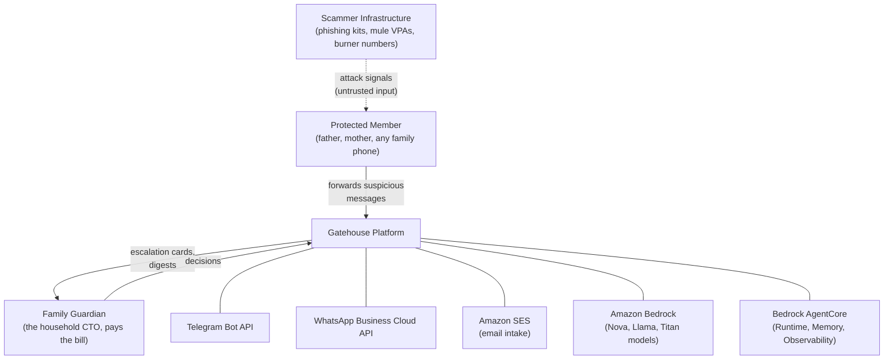
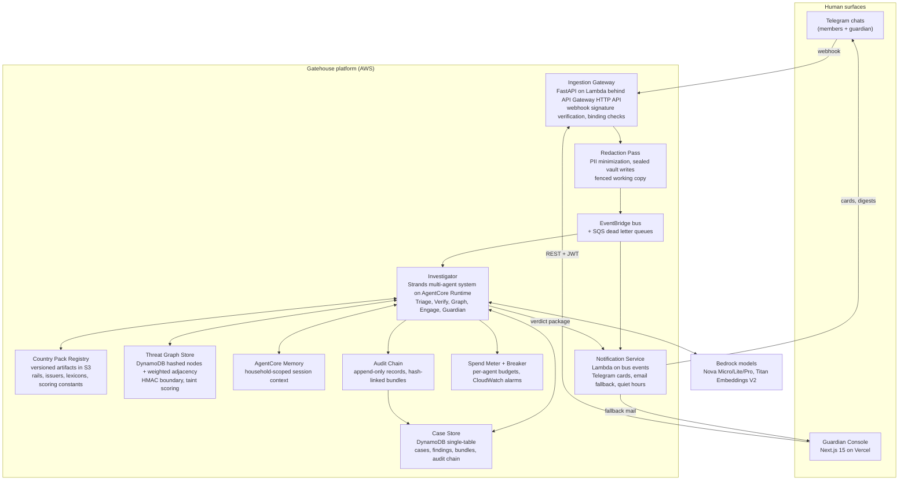
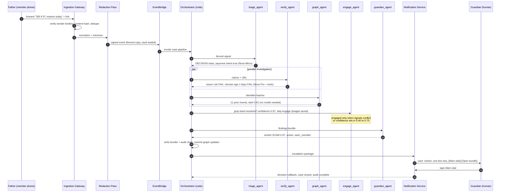
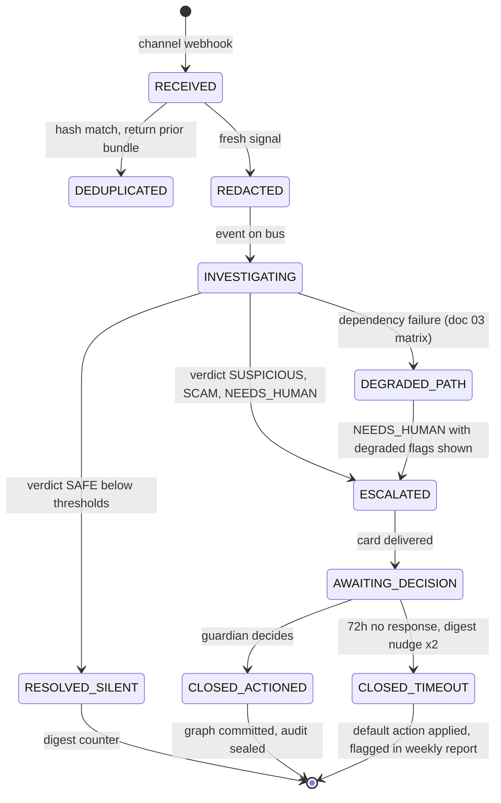
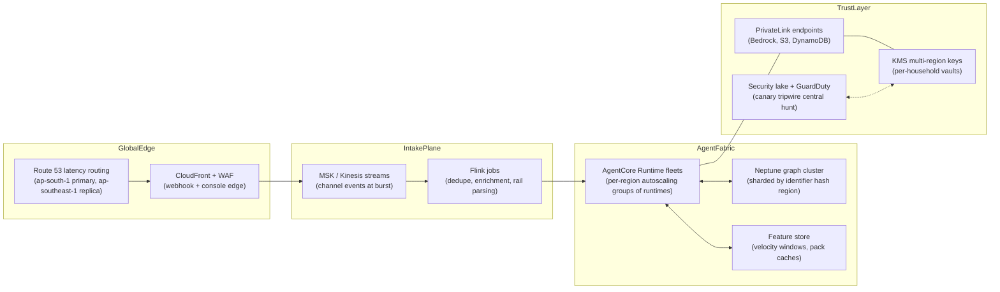

# 03 System Architecture

## Document Control

| Field | Value |
|---|---|
| Version | 0.3.0 |
| Status | Draft for owner review |
| Owner | Prakhar Shukla |
| Depends on | 01-vision, 02-product-spec |
| Last updated | 2026-08-26 |

## Changelog

| Version | Change |
|---|---|
| 0.3.0 | Added section 8.2: live routing verification executed 2026-08-26 from ap-south-1, corrected verify-fallback policy (us.meta profile invalid outside US regions), ritual scripted for repeat runs |
| 0.2.0 | Replaced ASCII sketch with professional Mermaid diagrams: system context, container view, investigation sequence, case lifecycle. Added production-topology-at-scale section and model routing policy with verification requirements |
| 0.1.0 | Initial draft |

## 1. Problem Statement (restated)

Screen every risky inbound signal reaching a household, investigate each like a
professional fraud analyst (verification against authoritative references,
cross-event identity linkage, controlled scammer engagement), escalate only real
decisions to the family guardian with explainable evidence, and publish honestly
measured precision, recall, false-gate rate, and cost per investigation.
Recommend, never act.

## 2. System Context (C4 level 1)



Trust boundary note: scammer infrastructure never talks to Gatehouse directly;
it talks to humans, who forward evidence. Every arrow crossing into the platform
from the left half of the diagram carries untrusted content and enters through
the fencing layer (doc 08 section 4).

## 3. Container View (C4 level 2)



## 4. Investigation Sequence (Journey A end to end)



## 5. Case Lifecycle (state machine)



## 6. Primary Data Flow (walkthrough of one event)

1. **Receive**: Telegram webhook hits API Gateway; Lambda verifies secret token
   header against SSM value; sender must be a linked member else polite refusal,
   no case created.
2. **Normalize**: text extraction (OCR only when no text layer), language
   detection, unicode normalization, content hash, dedupe window check (72h).
3. **Minimize**: typed placeholders replace raw identifiers ([PHONE_1] etc.);
   originals sealed into the per-household KMS vault; the working copy is all
   downstream components ever see. Model calls never receive raw originals when
   a placeholder suffices, which also cuts token spend.
4. **Dispatch**: signed event onto EventBridge; case row created in state
   REDACTED; DLQ attached; idempotency key = channel + content hash + household.
5. **Investigate**: orchestrator (deterministic Python, not model routing) runs
   the doc 04 sequence. Models decide within stages; code decides between stages.
   Every agent span exported via OpenTelemetry; every token counted into the
   spend meter; breaker checked before each stage.
6. **Decide**: guardian_agent composes the human-facing package from structured
   findings using pack-versioned thresholds and action catalogs. Narrative is
   generated last and is the ONLY generated prose; verdicts come from findings,
   never from vibes.
7. **Persist**: immutable evidence bundle (hash-chained to prior bundle),
   append-only audit records, graph commits in one idempotent transaction batch
   keyed by case id AFTER final verdict. A failed case leaves zero graph residue.
8. **Notify**: escalation card under 280 characters with two buttons, or silent
   digest increment for below-threshold outcomes. Quiet hours honored except
   EMERGENCY class.
9. **Close**: guardian decision (or timeout default) recorded; decision feeds
   back into taint weights and the eval harness override ledger.

Measured targets locked before P1 (verified again at P4 exit): forward-to-card
p95 under 30 seconds, p50 under 8 seconds, cost per investigation mean under
$0.02, noise notifications exactly zero.

## 7. Why This Shape (key decisions)

| Decision | Rationale |
|----------|-----------|
| Orchestrator as deterministic code, not LLM routing | Stage transitions are safety controls (budget gates, engage conditions, degradation ladders). Models decide inside stages; code owns control flow. Same principle as Sentinel: the LLM never scores |
| Five narrow agents over one general agent | Per-agent tool allowlists bound blast radius; contracts are individually testable; traces are readable; prompt changes are isolated and regression-gated |
| Investigator on AgentCore Runtime, gateway on Lambda | Agents need session isolation, memory, and OTEL for free; the gateway needs millisecond cheap always-on intake. Right compute for each job |
| Hashed threat graph shared across households | Cross-household reuse is THE intelligence advantage (Sentinel lesson generalized); HMAC + salt keeps re-identification infeasible; aggregate-only regional views protect minority households |
| Country packs as versioned data | Global core, local rails. New region = new YAML, not new code. Packs are pinned per case so every bundle replays exactly |
| Recommend-never-act enforced at tool layer | The capability simply does not exist: no payment APIs, no send-as-human APIs, no blocking APIs in any tool registry. Policy prompts are not controls |
| Single-table DynamoDB with declared access patterns | Every pattern in doc 06 section 6 has a named integration test before prod signoff, killing the classic forgotten-pattern failure mode |

## 8. Model Strategy and Routing Policy (Amazon Bedrock only)

Access verified against the builder account control plane (August 2026):
Anthropic models blocked; available families include Amazon Nova (Micro, Lite,
Pro, 2-Lite), Meta Llama 3.3/4, OpenAI gpt-oss 120b/20b, Mistral Large 3 and
Ministral 3, Z.AI GLM-5/GLM-4.7, Moonshot Kimi K2.5, NVIDIA Nemotron Super 3,
Qwen 3 Next, DeepSeek V3.2/R1, Google Gemma 3, Writer Palmyra X5.

| Job | Primary | Fallback | Selection criteria |
|-----|---------|----------|--------------------|
| Triage classification (high volume short text) | Nova Micro | Nova Lite | latency-first, classification-shaped, cents per million tokens |
| Claim verification adjudication | Nova Pro | Llama 3.3 70B | structured output conformance under fencing, instruction following |
| Engagement conversation | Nova Lite | Mistral Ministral 3 | multi-turn economy, persona adherence adequate for cautious-victim archetype |
| Narrative assembly (bundle prose, digests) | Nova Lite | gpt-oss 120b | fluent constrained summarization of structured findings |
| Claim embeddings (claim_check tool) | Titan Embeddings V2 | none needed | TruthLayer lineage, DynamoDB-cached |

Routing is env-configurable, pinned per case in audit records:

```
TRIAGE_MODEL            = amazon.nova-micro-v1:0
VERIFY_MODEL            = amazon.nova-pro-v1:0
ENGAGE_MODEL            = amazon.nova-lite-v1:0
NARRATIVE_MODEL         = amazon.nova-lite-v1:0
EMBEDDING_MODEL         = amazon.titan-embed-text-v2:0
FALLBACK_VERIFY         = meta.llama3-3-70b-instruct-v1:0
FALLBACK_NARRATIVE      = openai.gpt-oss-120b-1:0
```

P4 entry requirement: every routed model ID re-verified live (invocation smoke
test + constrained JSON probe) in the deploy region, results appended to this
section with dates, Sentinel doc style. Prompt-based JSON with fence-stripping
and jsonschema gate remains the confirmed design; no model on this account
guarantees native responseFormat JSON.

### 8.1 Live Verification Record (executed 2026-08-24, us-east-1, converse API)

Probed with one capped invocation each (charter budget rules honored):

| Model | Role | Result | Latency |
|---|---|---|---|
| amazon.nova-micro-v1:0 | TRIAGE primary | PASS | 616ms warm |
| amazon.nova-lite-v1:0 | ENGAGE/NARRATIVE primary | PASS | 531ms |
| amazon.nova-pro-v1:0 | VERIFY primary | PASS | 577ms |
| zai.glm-4.7-flash | cheap alternate / degraded-mode classifier | PASS | 465 to 513ms |
| us.meta.llama3-3-70b-instruct-v1:0 | FALLBACK verify | PASS | 1409ms |
| openai.gpt-oss-120b-1:0 | FALLBACK narrative | PASS (reasoning model: visible text may be empty at low maxTokens, needs >=512 output budget, reasoning blocks parsed separately) | 507ms |
| amazon.titan-embed-text-v2:0 | claim embeddings | PASS, 1024 dims | 917ms |
| amazon.nova-2-lite-v1:0 | candidate | FAIL: Invocation not supported in current account/region config; revisit at P4 | - |
| anthropic.claude-haiku-4-5 | candidate | FAIL: access blocked on builder account (consistent with Sentinel-era finding); Anthropic stays out of all chains | - |

Catalog notes from list_foundation_models (90 text models visible): newer
generations exist (Nova Premier, Claude Opus/Sonnet 5.x, GPT-5.6 family,
Kimi K2.5, MiniMax M2.5, Grok 4.6) but are deliberately unused here: they price
for frontier reasoning we do not need in high-volume screening paths. Cost
discipline beats model fashion. Re-run this exact probe script at P4 exit and
append deltas.

### 8.2 P4 Live Verification Record (executed 2026-08-26, ap-south-1, converse API)

Re-run of the full ritual from the DEPLOY region via the now-committed
`scripts/routing_ritual.py` (one capped invocation each, maxTokens=16, fixed
prompt, charter budget rules honored). Deltas against the 8.1 us-east-1 run:

| Role | Model ID | Result | Latency | Detail |
|---|---|---|---|---|
| TRIAGE primary | `apac.amazon.nova-micro-v1:0` | PASS | 870ms | reply ok, in=7 out=2 |
| ENGAGE/NARRATIVE primary | `apac.amazon.nova-lite-v1:0` | PASS | 409ms | reply Ok., in=7 out=3 |
| VERIFY primary | `apac.amazon.nova-pro-v1:0` | PASS | 527ms | reply Ok., in=7 out=3 |
| FALLBACK narrative | `openai.gpt-oss-120b-1:0` | PASS (invoked-ok) | 233ms | visible text empty at maxTokens=16, known reasoning-model shape from 8.1; production budget is >=512 |
| FALLBACK verify | `us.meta.llama3-3-70b-instruct-v1:0` | FAIL | 104ms | invalid model identifier FROM AP-SOUTH-1: the us. system-defined inference profile does not resolve outside US regions. The 8.1 PASS was region-local and never transferred |
| degraded-mode classifier | `zai.glm-4.7-flash` | PASS | 202ms | in=12 out=2 |
| candidate revisit | `amazon.nova-2-lite-v1:0` | FAIL | 163ms | still unsupported on this account/region config; stays out of all chains |
| candidate access check | `anthropic.claude-haiku-4-5` | FAIL | 79ms | access blocked on builder account; Anthropic stays out of all chains |
| claim embeddings | `amazon.titan-embed-text-v2:0` | PASS | 148ms | 1024 dims |

Policy corrections effective with this record:

1. FALLBACK_VERIFY for ap-south-1 deployments is NO LONGER
   `us.meta.llama3-3-70b-instruct-v1:0`. Until a cross-region fallback is
   re-verified live, verify-stage model loss degrades to NEEDS_HUMAN per the
   failure matrix (row 2), which the pipeline now implements as code.
   Candidate replacement to be verified before adoption:
   `apac.amazon.nova-lite-v1:0` (already PASS in-region).
2. Every routed PRIMARY (triage, engage/narrative, verify) plus embeddings
   resolves live from the deploy region. The routing table above section 8.1
   remains accurate for primaries; only the verify fallback row changes.
3. This ritual is scripted (`scripts/routing_ritual.py`) and must be re-run
   from the deploy region on any model ID or region change; results append
   here with dates.

## 9. Production Topology at Scale (documented, not built)

How the design maps past 100k households (shown for architectural credibility,
explicitly out of build scope until metrics demand it):



Scale envelope for reasoning: India UPI runs roughly 8,000 TPS average (NPCI
2026 disclosures); even 0.01 percent of scam-attempt volume screened exceeds
v1 capacity by orders of magnitude, which is why v1 optimizes for correctness
and honesty at 1k households and this section proves the growth path exists
without hand-waving.

## 10. Failure Handling Matrix (explicit degradation, tested not aspirational)

| Failure | Behavior | User-visible effect |
|---------|----------|---------------------|
| Triage LLM down | Rule classifier produces RULE_ONLY result from pack lexicons | None immediately; digest notes reduced accuracy mode |
| Verify/Graph LLM down | Verdict forced NEEDS_HUMAN with partial findings | Guardian told plainly: system could not complete verification |
| Graph store down | GRAPH_UNAVAILABLE finding, case continues | Weaker evidence, disclosed in bundle |
| Engage channel error | Engagement skipped, outcome NO_RESPONSE | None visible |
| Telegram API outage | Notifications queue with backoff; SES fallback after threshold | Delayed cards, honest banner in console |
| DynamoDB unavailable | Writes spool to SQS; reads serve stale with markers | Brief intake pause, zero data loss |
| Spend breaker trips | All agents drop to NEEDS_HUMAN passthrough; alarms fire | Console banner: cost protection active |
| Pack manifest invalid | Deploy blocked in CI; runtime serves last-good pinned version | None visible; release process holds |

Each row ships as a chaos test in the harness (doc 07) and must pass before P4
exit. Degraded behavior is a feature here, not an apology.
