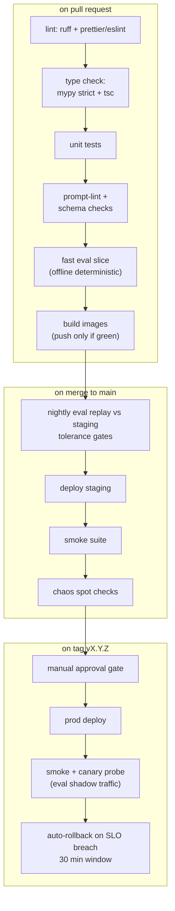

# 09 Deployment and Operations

## Document Control

| Field | Value |
|---|---|
| Version | 0.3.0 |
| Status | Draft for owner review |
| Owner | Prakhar Shukla |
| Depends on | 03-architecture |
| Last updated | 2026-08-26 |

## Changelog

| Version | Change |
|---|---|
| 0.3.0 | Added section 3.1: rollback rehearsal record with evidence table from the 2026-08-26 staging drill |
| 0.2.0 | CI/CD pipeline converted to Mermaid flow diagram |
| 0.1.0 | Initial draft |

## 1. Environments

| Env | Purpose | Data | Endpoint shape |
|---|---|---|---|
| local | Dev loop, unit + offline evals | Synthetic only, LocalStack optional | docker compose / direct uvicorn |
| staging | Integration, nightly evals, chaos | Synthetic + eval sets | staging.gatehouse.in API + AgentCore staging runtime |
| prod | Live households | Real P1 data under full controls | api.gatehouse.in + prod runtime, console.gatehouse.in |

Promotion: merge -> CI green -> auto-deploy staging -> tagged release + manual
approval -> prod. Prod deploy windows avoid soak-report hours (Sunday evenings).

## 2. Component Deployment

| Component | Method | Notes |
|---|---|---|
| Investigator (agents) | bedrock-agentcore-starter-toolkit: container image -> AgentCore Runtime | Image built in CI from strands app; config file versioned; runtime autoscaling defaults; session isolation per invocation |
| Gateway Lambda(s) | SAM | API GW HTTP APIs: telegram webhook, whatsapp webhook, SES targets, internal API for console |
| Tables/bus/queues | SAM stacks | Single-table main + dedupe index + DLQs with alarms |
| Console | Vercel | Next.js 15, env-scoped builds, preview deploys per PR |
| Country packs | S3 versioned artifacts | Publish job validates schema + checksums; pack_lookup pins versions per case |
| Notification service | Lambda on bus events | Telegram + SES fallback logic per doc 05 |

Bootstrap script (`make bootstrap`) provisions: KMS keys, SSM hierarchy, Cognito
user pool, Telegram webhook registration, AgentCore runtime, SAM stacks, pack
publish, smoke test. Clean-account-to-working-system target: under 45 minutes.

## 3. CI/CD Pipeline (GitHub Actions)

Rollback strategy: SAM stack version aliases + AgentCore runtime keeps prior
container revision; console promotes via Vercel instant rollback. Pack rollback =
manifest pointer flip (packs are immutable artifacts).

### 3.1 Rollback Rehearsal Record (staging, executed 2026-08-26)

The launch checklist item "rollback rehearsed once in staging for each
deployable component" is satisfied for the intake Lambda as follows:

| Step | Action | Evidence |
|---|---|---|
| 1 | Pre-P4 build (`71b4301`) rebuilt in an isolated git worktree, packaged separately | source zip 80333 bytes vs 83477 current |
| 2 | Rolled BACK: worktree artifacts deployed to the live staging stack | UPDATE_COMPLETE, IntakeFunction LastModified 11:37 UTC |
| 3 | Old code proven serving | 2/2 live Telegram sends PASS (p95 2.59s); ZERO case_trace lines in CloudWatch, the expected pre-trace behavior and a clean discriminator |
| 4 | Rolled FORWARD to current main build | UPDATE_COMPLETE |
| 5 | Recovery proven | 2/2 sends PASS (p95 2.35s); case_trace lines resumed with full reconstruction fields (verdict SCAM, spend $0.004, four stage timings) |

Procedure notes for future drills: rebuild the target commit in a worktree so
the artifact is byte-honest; pass secrets through the deploy script's env file
convention rather than copying values into command lines; use an observable
behavior delta (here, trace emission) between versions as proof of which build
is actually serving, never trust the deploy banner alone.

## 4. Observability

- Traces: OpenTelemetry spans per agent/tool/model call exported to CloudWatch
  via AgentCore observability; trace id attached to every case record so console
  links straight to the execution waterfall.
- Golden signals dashboard: forward-to-verdict latency p50/p95, verdict mix,
  degraded-mode share, escalation rate, cost/hour, webhook error rates, DLQ depth.
- Alarms: DLQ non-zero, latency p95 > 45s for 10 min, breaker trips, spend drift,
  canary breach (CRITICAL page), auth anomaly spikes.
- Audit trail: append-only audit records double as forensic log; log retention
  aligned with doc 06 TTLs; no raw P1 in logs (scrubbing processor enforced by
  test).

## 5. Operational Runbooks (written before launch, not after incidents)

1. Breaker tripped overnight: verify cause (spend drift vs flood), check for
   member-compromise pattern, restore caps, publish digest explaining degraded
   period honestly.
2. Channel outage (Telegram/Meta): switch notifications to email fallback
   automatically, status page update template, catch-up queue drain procedure.
3. Bad pack version shipped: manifest flip to prior version, re-run affected open
   cases flag, postmortem entry.
4. Suspected injection breakthrough: freeze case set since timestamp, canary
   forensics from audit spans, guardian comms template, fix + regression test
   before unfreeze.
5. Data subject deletion request: runbook executes cascade purge + certificate,
   SLA 7 days, logged.

## 6. Cost Model (unit economics honesty)

Per-investigation budget $0.02 mean breaks down approximately: triage $0.001,
verify $0.006 (embeddings cached aggressively), engage conditional $0.008,
guardian assembly $0.002, buffer $0.003. Infrastructure idle cost near zero
(serverless). At 1k households x 50 signals/mo x 20% investigate rate: ~$200/mo
model spend against $49k-99k gross potential at INR 99 ARPU. Unit economics work
at tiny scale, which is the whole point of the architecture.

AWS promo credits ($50 hackathon + existing credits) cover build phase; burn
reviewed weekly against charter budget rules.

## 7. Launch Readiness Checklist (all boxes or no launch)

1. Bootstrap script runs clean on fresh AWS account.
2. All doc 03 failure-matrix rows chaos-tested green.
3. Eval release gate passed including sealed hold-out, results committed.
4. Security section 9 checklist signed off.
5. Soak households live 14 days with weekly reports clean.
6. Status page + trust center live publicly.
7. Rollback rehearsed once in staging for each deployable component.
8. On-call reality check: single-builder ops means every alarm must be actionable
   async; anything requiring instant human response gets redesigned out.
