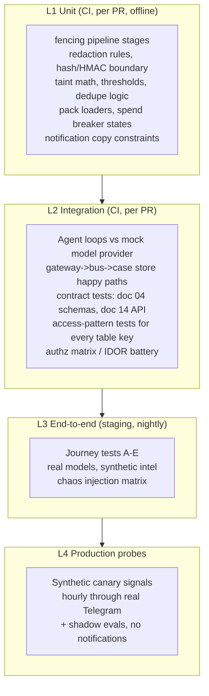

# 15 Testing Strategy

## Document Control

| Field | Value |
|---|---|
| Version | 0.1.0 |
| Status | Draft for owner review |
| Owner | Prakhar Shukla |
| Depends on | 07-evaluation, 03-architecture |
| Last updated | 2026-08-24 |

## Changelog

| Version | Change |
|---|---|
| 0.1.0 | Initial draft |

## 1. Test Pyramid (what lives where)

Ownership rule: every module ships with its unit suite in the same PR;
coverage floor 85 percent overall, 95 percent on fencing, orchestrator, spend
breaker, redaction (security-critical paths). Coverage is a gate, not a goal:
mutation-style assertions on tricky branches (boundary values in taint decay,
TTL edges) reviewed manually.

## 2. Layer Details

### L1 Units
Fast (<10s), zero network, seeded random where randomness exists. Property-based
tests (hypothesis) for: fence normalizer idempotence, HMAC determinism, bundle
canonical-JSON hashing stability across runs.

### L2 Integration
Strands mock model provider replays recorded completions; Bedrock never called
in CI (cost + determinism). Contract tests generated from Pydantic schemas
(doc 04) and OpenAPI spec (doc 14): any schema drift fails build. DynamoDB via
testcontainers or local emulator; every access pattern from doc 06 section 6
exercised by name. IDOR battery: cross-household access attempts on every
endpoint expect uniform 404.

### L3 End-to-end staging nightly
Journeys A through E scripted against staging with REAL models on synthetic
content only (budget-capped, ~200 cases). Chaos matrix: each doc 03 failure row
triggered by fault injection (network blackholes, throttled IAM, killed
containers); asserted degraded behaviors, never crashes, honest flags.
Latency percentile report attached to nightly run artifact.

### L4 Production probes
Hourly synthetic signal through the live Telegram path (marked household,
suppressed notifications), asserting forward-to-verdict SLO. Shadow replay of
yesterday's real cases against candidate prompt/pack versions before promotion,
diffing verdicts (any drift above tolerance blocks release). This is how we
change prompts in production safely.

## 3. Security Testing (details in doc 08 section 8)

Injection suite (150 adversarial prompts) runs nightly like any other test;
canary-trip drill quarterly; dependency audit weekly; image scan gates deploys.
Security tests are release-blocking at the same level as functional failures.

## 4. Non-Functional Tests

| Concern | Method | Gate |
|---|---|---|
| Latency | percentile reports from L3/L4 | p95 < 30s forward-to-card |
| Cost | spend meter assertion per journey run | mean <= $0.02/investigation |
| Load | 5 cases/sec sustained burst in staging monthly | zero DLQ residue |
| Console perf | Lighthouse CI budgets (doc 10 section 7) | mobile >= 90 core routes |
| i18n parity | locale completeness test en/hi | 100 percent keys |

## 5. Release Verification Ritual (per deploy)

1. CI green including contract + fast eval slice.
2. Staging deploy + smoke suite + one chaos spot check.
3. Manual approval: reviewer reads the diff AND the nightly eval delta.
4. Prod deploy behind aliases; canary probe green within 15 min.
5. Rollback rehearsed quarterly per component (calendar-owned).

## 6. What We Deliberately Do Not Automate Yet (honest scope)

Penetration testing (external, post-launch budget), load beyond burst-scale
design envelope (premature at v1), multi-region failover drills (single-region
prod until revenue justifies), browser-matrix UI automation beyond core flows
(Playwright covers queue + case detail only until console stabilizes).
