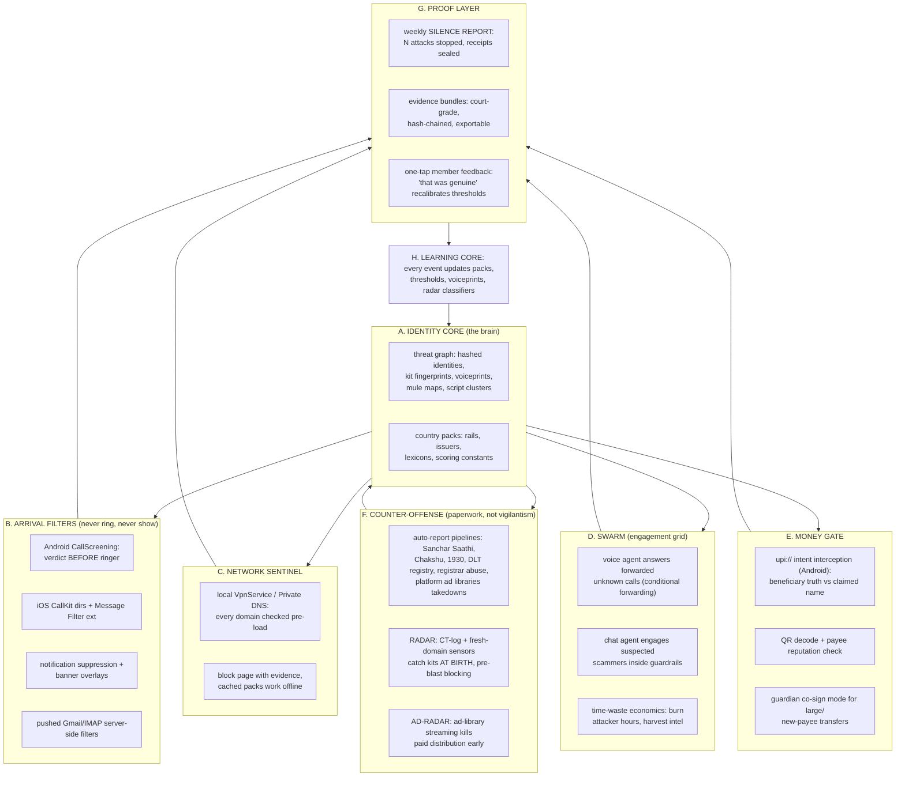

# 19 Silence Architecture (Master Vision)

## Document Control

| Field | Value |
|---|---|
| Version | 1.0.0 |
| Status | Owner-directed addition from strategy session, Aug 24 2026 |
| Owner | Prakhar Shukla |
| Depends on | 01, 03, 04, 05, 06, 08 |
| Last updated | 2026-08-31 |

## Changelog

| Version | Change |
|---|---|
| 1.0.0 | Initial locked version: the doctrine, eight-layer architecture, graduated silence law, lightweight-and-private engineering constitution, honest limits, golden hour recovery, product ladder |

This document is the north star above all other docs. Docs 02-18 describe what
we ship first. This describes what the company IS. Where older docs say "alert
the guardian," this document overrides with the doctrine below: alerting is the
failure mode of immature security. Silence backed by proof is the product.

## 1. The Doctrine

Positioning sentence: security companies sell alerts. Gatehouse sells silence,
backed by court-grade proof.

Three invariants every scam in history must consume from civilization:

1. A reachable identity: phone number, SIM, account handle
2. A place to exist: domain, hosting, app, group
3. A way to get paid: bank rail, mule wallet, payment handle

Defense-in-depth against messages treats symptom three times. Gatehouse attacks
all three invariants directly, plus the message surface where cheap to do so.

Definition of victory (engineering-honest): NOT zero attempts. Attempts continue
forever. Victory is when every attempt on a protected household ends in silent
failure, measurable cost to the attacker, and sealed proof for the defender.
We make scamming economically irrational on our population, then expand the
population until it is irrational everywhere. "Impossible" means the scammer's
expected profit per attempt on us is negative, permanently.

## 2. The Eight Layers

### 2.1 Layer B: Arrival Filters (the never-rings promise)

| Surface | Mechanism | Legality/platform status | Coverage limit |
|---|---|---|---|
| Voice calls (Android) | CallScreeningService: our app receives caller pre-ring, returns SCREEN/DISCONNECT verdict from graph + pack reputation | Official public API, user grants once | Android only; iOS uses CallKit blocked-list directories synced from our graph (number-based, no content) |
| SMS (Android) | default-handler route OR notification listener; verdict-driven silent filing | Default SMS role requires Play review; notification listener is consent-simple | content-based verdicts need role; fallback is number/hash reputation |
| SMS/MMS (iOS) | ILMessageFilterExtension classifies unknown-sender bodies ON DEVICE | Official entitlement, Apple approval required | SMS/MMS only, not iMessage/WhatsApp |
| Email | server-side filter push (Gmail filter API / IMAP rules) so mail never reaches inbox | fully supported | per-provider setup friction |
| WhatsApp | E2E encryption makes content unreadable to anyone; we suppress via notification layer + kill links at layer C + share-sheet investigation | encryption is physics, not policy | partial by design, disclosed honestly |

### 2.2 Layer C: Network Sentinel

Local VpnService (Android) or Private DNS hostname points devices at Gatehouse
resolver; iOS via content-filter Network Extension. Every connection's domain is
checked against cached pack blocklists plus live graph lookups. Hit behavior:
connection refused with local evidence screen (works in airplane-grade offline
via cached packs). This layer covers ALL apps and browsers, catches the click
even when the message was never seen. Battery cost near zero (event-driven),
data collected: domains only, hashed, never full traffic.

### 2.3 Layer D: Swarm

ScamShield DNA industrialized. Unknown calls routed by conditional forwarding
(user-dialed carrier codes, no root, works on feature phones) meet voice agent;
chat channels meet conversation agent under doc 08 guardrails. Output is triple:
wasted attacker hours (direct cost), harvested intel (scripts, numbers, mule
handles feeding layer A), and evidence for layer F reports.

### 2.4 Layer E: Money Gate

UPI collect intents and QR payloads parse to (payee_vpa, claimed_name, amount).
Graph verdict plus beneficiary-name truth rendered at the moment of tap; guardian
co-sign gate configurable for size/new-payee rules. We never move money; we arm
the final second with truth. The payment moment is the only point where the
scammer must present his real mule identity, making it the highest-value
checkpoint in the entire chain.

### 2.5 Layer F: Counter-Offense

Doctrine: fight with paperwork through official channels; the state becomes our
ally instead of our regulator. India already disconnected 9.4 lakh SIMs and
blocked hundreds of thousands of accounts through Sanchar Saathi, Chakshu, DLT
and I4C channels; nobody has automated the citizen contribution side. Our
report pipelines submit structured evidence bundles at machine speed. RADAR
(CT logs + newly-registered-domain sensors + kit fingerprints from our own
investigations) catches infrastructure at birth: campaign N funds the pre-block
of campaign N+1, eliminating the first-victim problem at its root. AD-RADAR
streams public ad-transparency libraries to kill paid distribution early.

### 2.6 Layers G and H

Proof layer converts invisible protection into felt value: weekly silence
report ("7 attacks stopped, here is each receipt, your week undisturbed"),
exportable hash-chained bundles, one-tap corrections that recalibrate the
system. Learning core closes the loop: every event, correction, engagement, and
radar hit updates packs, thresholds, voiceprints and radar classifiers. Layers
A-H form a flywheel: more households means faster learning means stronger
silence for every household.

## 3. The Graduated Silence Law (trust preservation)

Full silence is earned, never assumed. Confidence bands drive behavior:

| Band | Verdict confidence | Behavior |
|---|---|---|
| SILENT KILL | >= 0.95 malicious | never rings, never shows; logged + weekly report entry |
| AGENT SCREEN | 0.70 to 0.94 | call answered by swarm agent OR banner overlay; human sees result, zero panic |
| BADGED RING | 0.40 to 0.69 | normal ring with risk badge; user decides |
| PASS | < 0.40 or positive reputation | untouched, invisible processing |

Member corrections ("that was my doctor") instantly demote the indicator and
feed calibration; guardian sees correction stats in console. False silence is
tracked as a first-class metric beside false gates (doc 07). Trust dies faster
from one silenced hospital than from a hundred missed scams, so the dial stays
conservative until the graph earns aggression.

## 4. Lightweight and Private Engineering Constitution

The constraint "powerful but not heavy, secure but not data-hungry" is enforced
by architecture, not promises:

1. On-device first: quantized classifier (target under 10MB, TFLite/CoreML/ONNX)
   renders instant verdicts locally; cloud escalation only for gray-band cases.
2. Hashes travel, content stays: passive layers emit salted hashes of indicators
   (numbers, domains, payload fingerprints) to the graph; raw content leaves the
   device ONLY when a human explicitly forwards/shares it for investigation.
3. Local-first storage: verdicts and logs live encrypted on device; cloud retains
   hashes, verdicts, and opt-in sealed evidence only. Doc 06 TTLs apply.
4. Envelope budgets: app under 50MB install, under 1 percent daily battery,
   event-driven listeners (zero polling), full function on 2G/3G and Android Go;
   pack caches under 30MB cover a week offline. Feature phones join via the
   voice layer alone (no app at all).
5. Open core: classification rules, pack format, and eval harness are MIT
   public; auditors and regulators can verify the silence claims independently.
   Security through openness beats security through hope.

## 5. Honest Limits Register (read before promising anything publicly)

| Limit | Why | Our answer |
|---|---|---|
| Live deepfake VIDEO calls | E2E encrypted, cannot intercept content | golden hour module (section 6) + family safe-word protocol education + callback verification nudges |
| In-person and off-platform scams (romance moved to Telegram/dating/gaming) | no sensor on those surfaces | education surface + money gate still catches the PAYMENT moment wherever it started |
| SIM swap / number theft | telecom-side compromise | circle alerts on number port activity where obtainable; OTP-hygiene defaults; carrier escalation templates |
| Cold start | graph weak in week one | global packs seeded from public advisories + partner feeds; silence bands stay conservative until data accrues |
| Carrier variance (call forwarding codes/features differ per circle/operator) | fragmented telephony | per-carrier setup flows in onboarding; voice layer optional per household |

## 6. Golden Hour Recovery (the 1 percent path)

Absolute prevention does not exist; ownership of the aftermath does. One-tap
"I paid a scammer" flow: evidence bundle auto-formatted for NCRP/1930 filing,
helpline script generated, bank freeze-request letter prepared with transaction
hashes and timestamps, guardian notified with countdown checklist (freezing
within the first hour multiplies recovery odds dramatically). Recovery success
rate becomes another published, honest metric. No competitor owns the minutes
after the scam; we will.

## 7. Product Ladder Mapping

| Release | Layers activated | Notes |
|---|---|---|
| v1 (P1-P7, hackathon) | A (core graph), parts of D (chat engage), G (bundles), H (learning) | forwarding-based; proves the brain |
| v1.5 | B partial (notification layer, share sheet), E (money gate beta) | semi-passive arrives |
| v2 | C full network sentinel, B full call/SMS screening (Android), RADAR birth | THE silence release |
| v3 | D full voice swarm, F full counter-offense automation, iOS message filter entitlement | feature-phone coverage, state alliance |
| v3.x | AEGIS module: deepfake-media screening lineage (owner holds two published papers, IEEE PuneCon 2025 DOI 10.1109/PuneCon67554.2025.11379757, i-manager JIP 12(3) DOI 10.26634/jip.12.3.22384) retrained against current generators; forwarded voice notes, images, and video get authenticity verdicts inside evidence bundles; near-real-time scoring inside owned surfaces | differentiator module; graduated silence law and FP-harm metrics apply fully |
| v4 | international packs (Pix, GCash rails), insurance/bank partnerships around golden hour, AEGIS OEM trust-layer licensing (device-level media gates, the HMD-Fuse class of capability, via Android OEM partnerships) | category leadership |

## 8. Acceptance Criteria for This Document

1. Every layer names its platform-legal mechanism; nothing here relies on
   jailbreaks, scraping private systems, or ToS violations.
2. Graduated silence bands ship as configuration, tunable per household.
3. Constitution budgets (size, battery, offline) become test gates in doc 15
   additions during v1.5/v2 planning.
4. Limits register reviewed at every phase gate; new limits appended, none
   silently removed.
