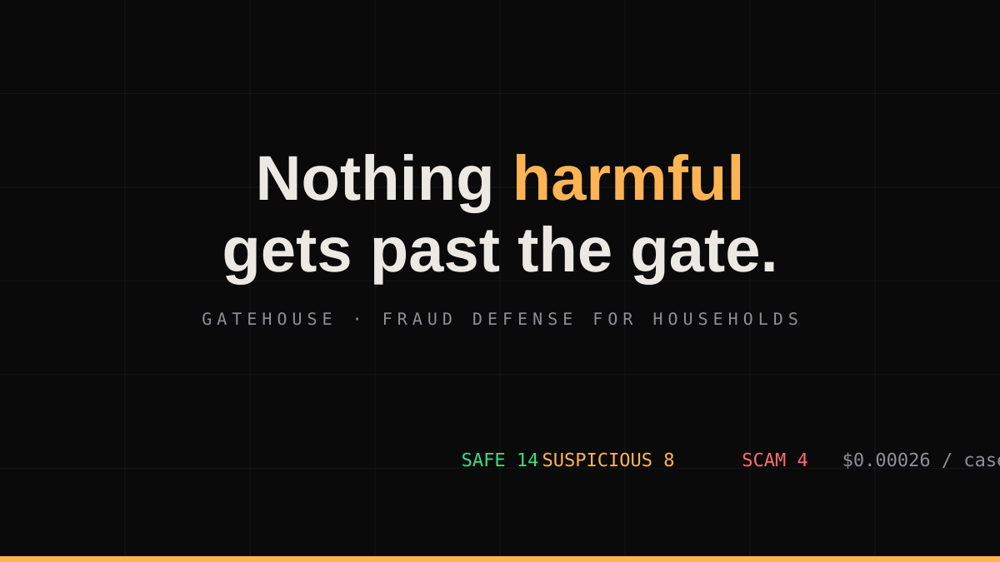
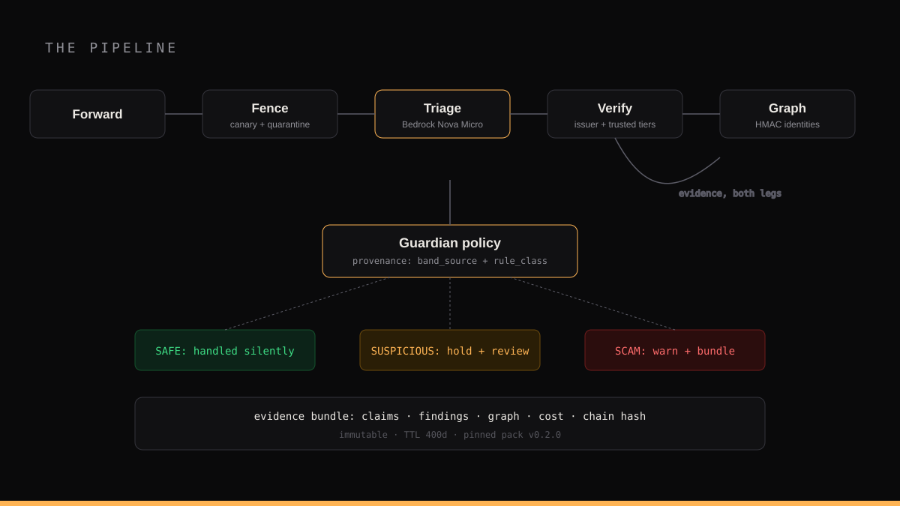
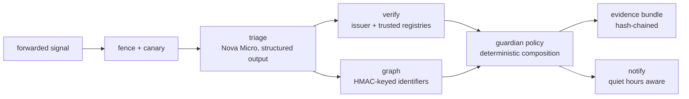
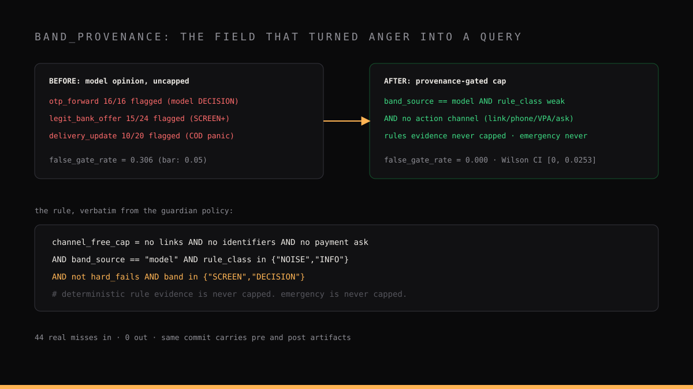

# Gatehouse: The Fraud Investigator That Lives in the Family Chat

*An engineering deep dive into building a household fraud-defense agent on AWS: a verdict policy where models propose and code decides, graduated silence as a product doctrine, an evaluation protocol that published 30.6 percent before 0.0 percent, and the consent boundary that keeps the agent on a leash.*



---

Two almost identical messages arrived in the same family chat, eleven minutes apart, on the first day of real use.

> "Sent Rs.349.00 from Kotak Bank AC X3047 to navircbpmobilerec.cf@axisbank on 18-05-26. UPI Ref 650470270016. Not you, https://kotak.com/KBANKT/Fraud"

> "Sent Rs.7.00 from Kotak Bank A/c X3047 to Nagpur Metro NMRC Ti on 26-08-26. UPI Ref 004421693139. Not done by you? Tap https://kotak.bank.in/KBANKT/Fraud"

A human skims both and feels the same thing: my bank says fraud happened, click here. A regex blocks both. A model panics on both. The correct answers are **different**, and the difference is invisible in the text: the first link sits on the bank's genuine surface, so the fraud-report path is real even though the message shape is phishing bait; the second points at `kotak.bank.in`, a spoof domain one character-class away from the real one. The first verdict was a conservative escalation with evidence attached. The second was a hard SCAM with the guardian notified and the member warned before any click.

This post is the full engineering story of **Gatehouse**, the system that made that discrimination: an agent team on Amazon Bedrock that investigates forwarded messages like a fraud analyst, a verdict policy with a provenance field that survived contact with real traffic, the graduated silence law that keeps the product inside a family chat without becoming noise, and an evaluation protocol designed so that dishonesty is structurally inconvenient.

Everything below is real, measured, and reproducible. The repository is public; one command regenerates every number.



## Table of contents

1. [The problem, quantified](#1-the-problem-quantified)
2. [The architectural line: models propose, code decides](#2-the-architectural-line)
3. [Registries beat vibes](#3-registries-beat-vibes)
4. [The provenance field that saved the product](#4-the-provenance-field)
5. [The graduated silence law](#5-the-graduated-silence-law)
6. [The engagement leash](#6-the-engagement-leash)
7. [The evaluation protocol](#7-the-evaluation-protocol)
8. [Production hardening](#8-production-hardening)
9. [What broke](#9-what-broke)
10. [Limitations, honestly](#10-limitations-honestly)
11. [Reproduce it](#11-reproduce-it)

## 1. The problem, quantified

Global scam losses were estimated at **$1.03 trillion in 2024**, and roughly one in four people who encountered a scam lost money to one. In India, the attack surface is concentrated on two rails: UPI and WhatsApp. TheUPI collect-request abuse turns the payment rail's own UX against victims ("scan to RECEIVE" confusion attacks), KYC-expiry phishing harvests banking credentials, and digital-arrest scripts impersonate police via video calls. The victims are not merchants with fraud teams. They are **families**, and the first line of defense is not a firewall, it is a family chat where someone says "beta, is this real?"

Every existing tool sits in the wrong place. Caller-ID apps label phone numbers after the fact. Bank alerts fire after money has moved. Nothing investigates the attack itself while it is still a message sitting on a family member's phone. That window, between "message received" and "money sent", is where Gatehouse operates, and it is measured in minutes, not milliseconds.

The constraint set follows from the audience: the system must run serverless (zero fixed cost), the verdict path must complete in seconds (the victim is deciding *now*), every claim must be explainable to a worried 60-year-old (evidence bundles, not confidence bars), and the total Bedrock spend must fit inside promo credits (hard caps in code).

## 2. The architectural line {#2-the-architectural-line}

The obvious architecture lets the model classify and the code forwards the answer. We burned 30.6 percent of benign traffic learning why that fails, but the doctrine came first, recorded as the project's first ADR:

> **ADR-001: Models propose scores. Code decides verdicts.** The model returns a likelihood plus a reason, never a class. A deterministic rule engine bands signals independently from versioned pack data. The guardian composes the final verdict from evidence, and every result carries provenance: which leg drove the final band, and what the rules alone concluded.

The consequences are measurable. The same input always yields the same verdict (the mock runner regenerates the dev split byte-identically). Every verdict decomposes into named evidence: `HARD_FAIL_ISSUER_RULE`, `GRAPH_PRIOR_EVENTS`, `NO_ACTION_CHANNEL`. And when the model leg is down, the deterministic brain takes over as RULE_ONLY with an honest flag, never a silent guess.

The pipeline is five stages behind fault boundaries:



Triage runs on **Nova Micro through the APAC inference profile** (~$0.00026 per case measured, structured output called at the model interface, not through the agent loop, because Strands registers the output schema as a tool named after the class and a leading underscore in the class name broke every call; that bug is in the ledger). Verify and graph are pure code. The guardian is pure policy. Only one stage touches a model, and the model can never overrule it.

## 3. Registries beat vibes {#3-registries-beat-vibes}

The component that made the Kotak discrimination possible is embarrassingly simple: **versioned registries in a country pack**, shipped as schema-validated YAML.

- **Issuer registry**: every bank's official domains (SBI, HDFC, ICICI, Kotak, UCO, and peers), with aliases in English and Hindi.
- **Trusted-service tier** (added during the evaluation build): non-issuer brands whose link surfaces are legitimate: Amazon, Flipkart, Swiggy, Zomato, IRCTC, BlueDart, Delhivery, DHL, FedEx, government portals. Kept deliberately separate from issuers, because trusting a retailer says nothing about a bank.

Every URL in a signal is adjudicated three ways: inside the issuer registry (PASS), inside the curated trusted tier (PASS at lower weight), or unknown (INCONCLUSIVE, never FAIL, because we do not yet know a fresh domain's age or reputation). Every **brand claim** in the text ("Kotak says...") is adjudicated against the same registries: a claim with all links inside the claimed party's official domains is a PASS and arms the evidence-based rescue; a claim with links outside is a hard FAIL and the verdict is SCAM regardless of what the model felt.

The pack is data, versioned (`v0.2.0`), pinned into every bundle by hash, and community-extensible. When scam scripts mutate, the fix is a pack PR with a regression run, not a prompt prayer.

## 4. The provenance field that saved the product {#4-the-provenance-field}

The first real-model evaluation run on the 480-case dev split produced the most useful bad number of the project: **precision 1.00, recall 1.00, false-gate rate 30.6 percent**. All 44 false gates were benign: OTP forwards a member sent themselves, linkless bank offers, courier cash-on-delivery notes. The deterministic runner had zero misses on the same split. The failure lived entirely in the model leg.

Because every triage result carries **`band_source`** (`model` or `rules`) and **`rule_class`** (what the deterministic leg concluded alone), the 44 misses decomposed in minutes instead of days:

| Stratum | Flagged | Mechanism |
|---|---|---|
| otp_forward | 16/16 | model reads "OTP" as danger; message has no link, no handle, no ask |
| legit_bank_offer | 15/24 | linkless branded offers scored DECISION by model alone |
| delivery_update | 10/20 | genuine COD notes; "pay" triggered the payment guard on the rescue |
| newsletter_promo | 3/28 | linkless promotional traffic, model-only SCREEN |

The fix was a policy rule with two hard limits, and this is the part worth stealing:

> A band driven by the **model** over **weak rule evidence** (rules concluded NOISE or INFO), on a message with **no action channel** (no link, no phone, no VPA, no UTR, no payment ask), cannot interrupt a human. A gate guards actions, and there was nothing to act on.

Deterministic rule evidence is **never** capped, or text-only scam scripts in Hindi would lose their escalation. Emergency bands are never capped. The payment ask keeps its own channel, except when a fully verified brand link exists and zero collectable handles were extracted (the COD reality). Post-fix: false-gate **0.0 percent**, precision and recall 1.00 with Wilson CI [0.9887, 1.0], and the pre and post artifacts are committed beside each other so nobody has to trust the summary.



The deeper lesson: **provenance turned "the bot is trash" into a query**. The builder's own words during the live incident were angrier than that, and the band_source field is what converted the anger into a 30-minute fix with a regression test.

## 5. The graduated silence law {#5-the-graduated-silence-law}

A fraud system that cries wolf gets muted by the family, and then it protects no one. Gatehouse's product doctrine, written before the first screen, is the **graduated silence law**:

- **Level 1, silent handling.** Newsletters, family chatter, genuine delivery updates: screened, recorded into the weekly digest, invisible. On the live soak so far, 14 of 26 real cases ended here. The quiet week is the product working, and the digest page in the console exists to prove it happened.
- **Level 2, soft warn.** Gray-band signals get a calm member-visible reply: "we found warning signs, hold off until your guardian confirms." Never an accusation, never a block.
- **Level 3, the gate.** Hard evidence or emergency bands escalate to the guardian with the bundle: claims, verification findings, graph taint, per-stage cost, chain hash. Humans decide anything touching money.

Quiet hours (22:00 to 07:00 IST) queue level-2 and level-3 notifications into the morning digest; scams never wait, but newsletters never wake anyone. The daily digest tick is verified firing against the live table, and the digest view is computed from the same rows, so the console and the Telegram summary can never disagree.

## 6. The engagement leash {#6-the-engagement-leash}

The most dangerous component is the one that talks back: an agent that engages suspected scammers to confirm scripts. Its constraints are structural. Consent is enforced at **both scopes**, the household flag and the forwarding member's own consent, with refusal (`member_not_consented`) before the model is ever touched; a test proves the model is literally never called without it. Hard limits are constants: **6 turns maximum, 10 minutes wall clock, 1200 output tokens**, one engagement per case unless the guardian explicitly retries. Outbound replies pass a content firewall before delivery (the agent never plays a minor, an official, or a real named person); inbound scammer text passes threat detection before the model sees it; spend is metered per turn and the breaker can kill the session mid-conversation. Stop conditions are enumerated in code, including the scammer asking for money movement.

Every transcript lives in the case bundle. The audit trail of what the agent said, and why it stopped, is a product surface.

## 7. The evaluation protocol {#7-the-evaluation-protocol}

The benchmark is 600 cases across 15 strata (doc 07 table: KYC scams, digital arrest, investment groups, UPI collect abuse, lottery, courier, job scams, relative impersonation, and five benign strata including deliberate false-gate traps), generated slot-filled and seeded, with cross-split overlap made structurally impossible: shared template text lives behind unique reference tokens, so a dev string cannot appear in the hold-out. The split is 480 dev, 120 hold-out. The hold-out opens exactly twice, once mid-build, once at release, and every opening embeds seed, pack hash, floor, and reason.

The full protocol, each rule paid for by an incident:

- **Wilson 95 percent intervals** on every published proportion. Precision 1.00 on 336 scam cases prints as CI [0.9887, 1.0], not as perfection.
- **Pre and post published together.** The 30.6 percent run shipped in the same commit as the 0.0 percent run.
- **Failure taxonomy from the run's own ledger.** Every miss is classified into seven named buckets by code, never by hand-written humility.
- **The denominator is auditable.** The first live soak report read 103 rows and implied a 72.7 percent escalation rate; the real household window was 26 cases at 46 percent, because 93 rows predated the persistence contract and 77 were journey-harness fixtures. The report now states its exclusions inside the artifact.
- **Spend is a metric.** Every call is metered per token; breakers cap whole runs by USD and call count; and when the rate table missed the APAC profile prefix, the 15x overstatement showed up as a disagreement between two measurement surfaces. Fail expensive, never cheap.

The live numbers at the time of writing: 26 real household cases, 14 handled silently, 4 SCAM, 8 SUSPICIOUS, zero degraded incidents, mean spend per case **$0.00026**, roughly 76x under the $0.02 bar.

## 8. Production hardening {#8-production-hardening}

The failure matrix in the architecture doc promised degraded behaviors that did not exist until a chaos suite ran every row on every push. The rows that earned permanent tests: verify loss forces **NEEDS_HUMAN with VERIFICATION_UNAVAILABLE** instead of a quiet SAFE; graph outage raises **GRAPH_UNAVAILABLE** on the case while an empty result (no identifiers to correlate) is correctly *not* an outage; dedupe fails open with a warning; breaker refusals surface as `TRIAGE_BUDGET_REFUSED` on the package; a canary token appearing anywhere outbound is intercepted (**CANARY_TRIP**) before delivery.

Delivery-side hardening came from live scars: Telegram retries any webhook answered with non-200 forever, so member-correctable conditions answer 200 with a friendly reply instead of becoming poison-message storms; every member-visible reply goes through `sendMessage` because webhook bodies are discarded; reserved DynamoDB keywords are routed through expression-attribute-name guards by a conftest assertion that fails the suite on any bare reserved word, because a green suite once shipped a 500ing bind path.

## 9. What broke {#9-what-broke}

The public ledger (`docs/what-broke.md`) has 20+ entries with symptom, root cause, fix, and a permanent guard. Highlights that generalize:

- **A private class name broke every structured call.** Strands registers the output schema as a tool named after the class; `_TriageModel` produced tool name `TriageModel` and both call paths failed with spend at zero. Guard: any class registered as a Bedrock tool gets a public name and a live-model smoke test.
- **One-polarity rules accumulate false positives forever.** The issuer check could only fail, never pass. Guard: every rule defines both outcomes, with row tests.
- **The log formatter dropped context from every direct logging call site.** Structured context flowed through one private attribute and the formatter read only that one; a field's absence in production logs is as loud as a crash. Guard: a test for every documented way callers attach context.
- **Consent had one scope.** The household flag was honored, the member's own consent was not consulted. Guard: both scopes enforced at the engage boundary, refusal before the model.

## 10. Limitations, honestly {#10-limitations-honestly}

- The benchmark author and the detection lexicons share one brain. The running soak, with real households and real attacks, is the independent judge, and its first weeks matter more than any dev number.
- URL shorteners stay INCONCLUSIVE until URL intel lands. The gate limits instead of guessing, which is correct behavior that users can still experience as unhelpful.
- Guardian agreement is the newest instrument; live precision is behaviorally observed, not yet numerically measured.
- One model leg is calibrated. Routing to a different model reopens the calibration protocol with a new pre/post pair.
- Single region, single deployment, by design at v1 scale.

## 11. Reproduce it {#11-reproduce-it}

```bash
git clone https://github.com/Prakhar2025/gatehouse
cd gatehouse && make setup
make check             # format, lint, strict types, 415 tests
make pack-validate     # country pack v0.2.0
make eval-mini         # offline 30-case benchmark
make eval-full-json    # 480-case dev split through the real pipeline, mock mode
python -m gatehouse.evaluation.run_full --model-mode staging  # real model, hard-capped
```

The staging runner makes real Bedrock calls over reserved-domain synthetic content, bounded by a shared spend breaker (USD and call caps), printing running spend every 25 cases. The full staged evaluation cost **$0.1251**. The failure taxonomy, the pre and post artifacts, and the what-broke ledger live in `docs/` next to the code that earned them.

Nothing harmful gets past the gate, and now you have seen the receipts.
