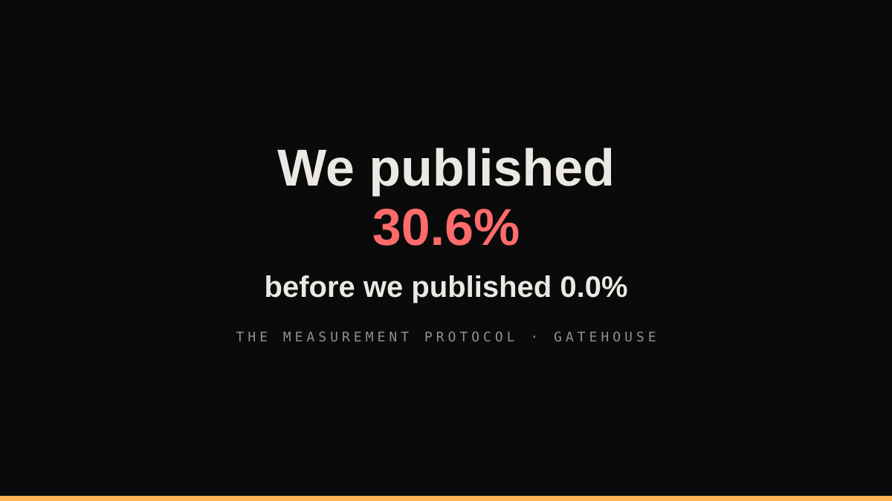

# Publishing 30.6 Percent: A Measurement Protocol That Makes Dishonesty Inconvenient

*An engineering deep dive into the evaluation architecture behind Gatehouse, a household fraud-defense agent: sealed hold-outs that open twice and only twice, provenance fields that turn user anger into queries, denominators that survive audit, and why the worst number we ever produced is the one we lead with.*



---

The most useful number Gatehouse ever produced is a bad one. On the first evaluation run with a real model in the loop, the system flagged **44 of 144 benign messages as threats**: a false-gate rate of 30.6 percent against a bar of 5 percent. Precision was perfect, recall was perfect, and the product was, by its own definition, unusable. A fraud shield that interrupts a family twelve times a week gets muted by the family, and then it protects no one.

We published that number first, in the same commit as the fixed version. This post is about the protocol that made publishing it the path of least resistance, because the protocol's job is not to produce good numbers. Its job is to make bad numbers **impossible to hide from yourself**.

Everything below is real, measured, and reproducible. The repository is public; one command regenerates every number in this post.

## Table of contents

1. [The doctrine](#1-the-doctrine)
2. [The dataset that cannot leak](#2-the-dataset-that-cannot-leak)
3. [The sealed hold-out opens twice](#3-the-sealed-hold-out)
4. [Pre and post, in one commit](#4-pre-and-post)
5. [Provenance: turning anger into a query](#5-provenance)
6. [The denominator must survive an audit](#6-the-denominator)
7. [Spend is a metric, not a receipt](#7-spend-is-a-metric)
8. [The taxonomy writes itself](#8-the-taxonomy)
9. [What this buys you](#9-what-this-buys-you)

## 1. The doctrine

Four rules, each one paid for by an incident:

> **Rule 1: Wilson 95 percent intervals or silence.** Precision 1.00 on 336 scam cases prints as CI [0.9887, 1.0]. Without the interval, "perfect" is a vanity claim that collapses on the first live miss.
>
> **Rule 2: Pre and post publish together.** A threshold change without its before-number is a confession you did not keep.
>
> **Rule 3: The failure taxonomy is generated from the run's own miss ledger.** Never hand-written humility; the classification is code.
>
> **Rule 4: Every number names its denominator.** A percentage over rows nobody can audit is a number nobody should trust.

The rest of this post is those four rules, made structural.

## 2. The dataset that cannot leak {#2-the-dataset-that-cannot-leak}

The benchmark is 600 synthetic cases across 15 strata: KYC-expiry scams in English and Hindi, digital-arrest scripts, investment groups, UPI collect abuse, lottery advance-fees, courier customs, job scams, relative impersonation, and five benign strata including deliberate false-gate traps (genuine bank offers with links, government refund notices, delivery updates, members' own OTP forwards).

Synthetic by design and by law: real fraud data from real families is both unavailable and unconscionable. The generator's job is to make the detector's life hard, not easy. And the split discipline is where most evaluation setups quietly cheat themselves:

- **480 dev, 120 hold-out**, generated by the same slot-filling generator from different seeds.
- **Cross-split leakage is structurally impossible, not asserted.** Shared template text lives behind unique reference tokens: dev reference numbers are drawn from 10000 to 49999, hold-out from 50000 to 99999. A dev string cannot appear in the hold-out because the strings are different by construction. An overlap check runs anyway and fails the suite if it ever finds one.
- Every case carries ground truth labels for verdict, intent tags, expected action, language, and difficulty tier, because per-stratum confusion is the only confusion table worth reading. Aggregate accuracy hides exactly the failures that matter, such as false gates concentrated in the legitimate-bank-offer stratum.

## 3. The sealed hold-out {#3-the-sealed-hold-out}

The hold-out opens exactly twice in the product's life: once mid-build as a sanity check, once at release for final numbers. The runner enforces it in code: `--split holdout` refuses to execute without `--confirm-holdout --reason "..."`, and the opening embeds seed, pack version, floor, and the operator's reason into the payload forever. Every look at the hold-out is an auditable event.

Calibration happens on the dev split only. When the screening floor was swept across an eight-point grid, the selection rule was written before the sweep ran: minimum false-gate subject to a recall target, ties resolving toward the baseline, because a tie resolved toward "improvement" is how systems churn thresholds and call it tuning. The sweep found floors 0.25 through 0.45 statistically identical; the published recommendation was **no change**, with the grid showing exactly where recall falls off a cliff above 0.50.

That is what a calibration artifact should look like: a recommendation to do nothing, with the evidence for why.

## 4. Pre and post {#4-pre-and-post}

The 30.6 percent incident, as a timeline:

1. First staging run with the real model: recall 1.00, false-gate 30.6 percent. All 44 misses benign, all model-driven.
2. The miss ledger (every miss exported with its verdict artifacts, not just a count) decomposed the 44 by stratum and mechanism in minutes: OTP forwards the model panicked on, linkless bank offers, COD notes where a payment word had armed a guard.
3. The fix was policy, not prompting, and it shipped with a regression test at the guardian level for every polarity of the new rule.
4. Second run: false-gate 0.0 percent, same seeds, same pack, same floor. Both JSON artifacts committed side by side: `staging-dev-metrics-pre.json` and `staging-dev-metrics.json`.

The pre file is the important one. Anyone can ship a perfect number; the pre file is the proof you earned it.

## 5. Provenance {#5-provenance}

The single highest-leverage field in the codebase costs two properties on one schema:

```text
TriageResult:
  signal_class, confidence, payment_intent, urgency_signals[],
  reason_code,
  band_source (model|rules), rule_class
```

`band_source` records which leg drove the final band; `rule_class` records what the deterministic rules concluded alone. When the user says "the bot is trash," the query is not rhetorical, it is literal: pull the misses, group by `band_source`, and the answer falls out. In our case: every false gate was `band_source == model` over `rule_class` in {NOISE, INFO}. The deterministic leg had zero misses on the same split.

The fix inherited the same discipline: caps apply **only** to model-driven bands over weak rule evidence, on messages with no action channel. Deterministic evidence is never capped, because text-only scam scripts in Hindi must keep their escalation. Emergency bands are never capped, period. Every one of those clauses has a test.

Provenance is how a user complaint becomes a pull request instead of a vibe.

## 6. The denominator {#6-the-denominator}

The first live soak report read 103 rows from the production table and implied a **72.7 percent escalation rate**. The real household window was 26 cases at 46 percent. The difference: 93 rows predated the persistence contract and carried no timestamp, and 77 rows were journey-harness fixtures from a load test, sitting in the same table as the family's traffic with nothing distinguishing them.

Two guards came out of it. The report now states its exclusion rules inside the artifact itself (soak-window start, harness tag exclusion, smoke-tag exclusion), and automated senders are being moved to a marker household so exclusion is structural rather than editorial.

The general law: **shared production tables accumulate test traffic, and any report over them must name its denominator or it is fiction.** Our 30.6 percent was bad; a 72.7 percent escalation rate over a polluted denominator would have been worse, because it would have been confidently wrong in the direction of alarm.

## 7. Spend is a metric {#7-spend-is-a-metric}

Every model call is metered with token-level cost estimates. Whole evaluation runs are bounded by a shared spend breaker: maximum USD and maximum calls on one meter, so the chaos-tested breaker semantics that protect production also bound the evaluation. Progress prints every 25 cases with running spend. The staged evaluation of 480 real-model cases cost **$0.1251**.

The meter is itself tested, which sounds absurd until it saves you: our deployed model id carries a regional inference-profile prefix (`apac.amazon.nova-micro-v1:0`), the rate table keyed on the bare id, and every lookup fell through to the conservative fallback: a systematic **15x overstatement**. It was caught because two measurement surfaces (the live case trace and the runner) disagreed, and the error was in the safe direction. The lesson generalizes: price by the actual ids in your config, fail expensive never cheap, and make your meters disagree loudly.

## 8. The taxonomy {#8-the-taxonomy}

Every miss is classified by code into seven buckets: `missed_pattern_family`, `language_gap`, `verification_tool_gap`, `threshold_miscalibration`, `orchestration_bug`, `degraded_mode_cause`, `labeling_dispute`. Counts go into the results payload. The taxonomy document for the 30.6 percent incident lists the stratum-level mechanisms and two live observations (a genuine courier forward that reached a guardian, a meter mispricing), each with its root cause and the permanent guard installed.

The point of a fixed vocabulary is not bookkeeping. It is that the failures become **addressable classes**: the top class gets fixed next week, the second class the week after, and "the bot is bad sometimes" never survives contact with a classifier.

## 9. What this buys you {#9-what-this-buys-you}

The protocol's outputs, honestly: a dev split that regenerates byte-identically from one command, a hold-out that has never been peeked, a published failure history that includes our worst day, a live soak denominator that survives audit, and spend numbers you can hand to a CFO.

But the real product of the protocol is cheaper conversations. When a family member says the bot flagged their delivery message wrongly, the answer is not an apology, it is a lookup: case id, band source, finding, class, fix date. When a judge asks how you know it works, the answer is a repository, not a claim.

Measurement honesty is not a virtue signal. It is the cheapest way to run a learning system, because the alternative is lying to yourself at scale, and paying for it in the one currency a trust product cannot mint back.

Reproduce every number: `make eval-full-json` for the offline split, `python -m gatehouse.evaluation.run_full --model-mode staging` for the capped real-model run. The pre and post artifacts are in `docs/eval-results/`, next to the taxonomy and the cost report.
